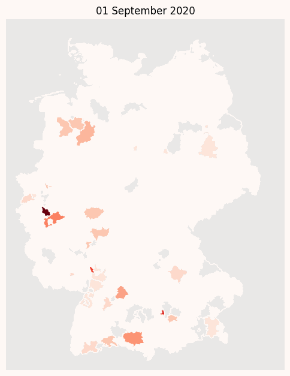

# Commandline tool for rendering a animated choropleth map (covid-19 spreading in Germany)

## Prerequirments

### Getting the data to visualize
Current covid-19 spreading data must be dowloaded from from (https://pavelmayer.de/covid/risks/all-series.csv)[https://pavelmayer.de/covid/risks/all-series.csv] first. 

The desired location is the root of this repo, but you can specific another place and filename with the `--data` commandline argument.

### Python 3

A working python3 environment is needed to run this tool.

Install all necessary python libraries by executing:

    $ pip3 install -r requirements.txt

## Usage
The map tool should be called from this directory, because it uses relative pathes to some files in this repo.

    $ python3 ./animated_choropleth.py

    usage: animated_choropleth.py [-h] [-s START] [-e END] [-d DATA] [--size SIZE] [--column COLUMN] [--cmap CMAP] [--edge_color EDGE_COLOR] [--vmin VMIN]
                                [--vmax VMAX] [--duration DURATION] [-p PARALLEL] [--maps_only]
                                [--file_format {eps,jpg,jpeg,pdf,pgf,png,ps,raw,rgba,svg,svgz,tif,tiff}]

    renders a animated choropleth map for a given persiod

    optional arguments:
    -h, --help            show this help message and exit
    -s START, --start START
                            start of period for generating maps
    -e END, --end END     end of period for generating maps
    -d DATA, --data DATA  csv which is used to render the map
    --size SIZE           size of generated maps in inch e.g 6x8
    --column COLUMN       csv column which is used to generate maps
    --cmap CMAP           matplotlib colormap (must be one of supported colors, look at
                            https://matplotlib.org/stable/tutorials/colors/colormaps.html?highlight=colormap)
    --edge_color EDGE_COLOR
                            color of county lines
    --vmin VMIN           lowest value that is mapped to a color (this paramter will have wield influence of the impression of the map)
    --vmax VMAX           highest value that is mapped to a color (this paramter will have wield influence of the impression of the map)
    --duration DURATION   duration of a frame in milliseconds
    -p PARALLEL, --parallel PARALLEL
                            numbers of cpu cores to use
    --maps_only           instead of creating a animated gif, store all figures in ./frames/ folder
    --file_format {eps,jpg,jpeg,pdf,pgf,png,ps,raw,rgba,svg,svgz,tif,tiff}
                            file format for maps only mode

If it will be called without any arguments, it renders a animated gif file `./InzidenzFallNeu_7TageSumme.gif` beginning at 2021-02-01 and ended at 2021-03-16.

### Render the maps without creating a animated gif

Rendering only the maps and store them under `./frames/` can be done by

    $ python3 ./animated_choropleth.py --maps_only

Creating a Video with ffmpeg:

    $ cd frames
    $ ffmpeg -framerate 24 -pattern_type glob -i '*.png' -vf "pad=ceil(iw/2)*2:ceil(ih/2)*2" -c:v libx264 -pix_fmt yuv420p out.mp4

Framerate is equal to playspeed. 24 Frames/secounds means every day will shown for 1/24 Secounds or 42 ms.

### More examples

Render a map for a specific period (iso notation of dates is necessary)

    $ python3 ./animated_choropleth.py --start "2020-04-01" --end "2020-05-01"

### Change output size

    $ python3 ./animated_choropleth.py --size 6x10

Size format must be declared in format of \<width\>x\<height\> in inches!

### Change colormap

    $ python3 ./animated_choropleth.py --cmap gnuplot_r

Use one of matplotlib included [colormap](https://matplotlib.org/3.1.0/gallery/color/colormap_reference.html)

Appending _r to a colormap will reverse the map.

### Use another column to colorize the map

    $ python3 ./animated_choropleth.py --column AnzahlFallNeu_7TageSumme_Dropped --cmap Reds --vmax 50 --start 2020-09-01 --end 2020-10-15 -p 4 --duration 200

This will visualize the number of cases that are not included in the incedense, for example for delayed reporting of counties.

